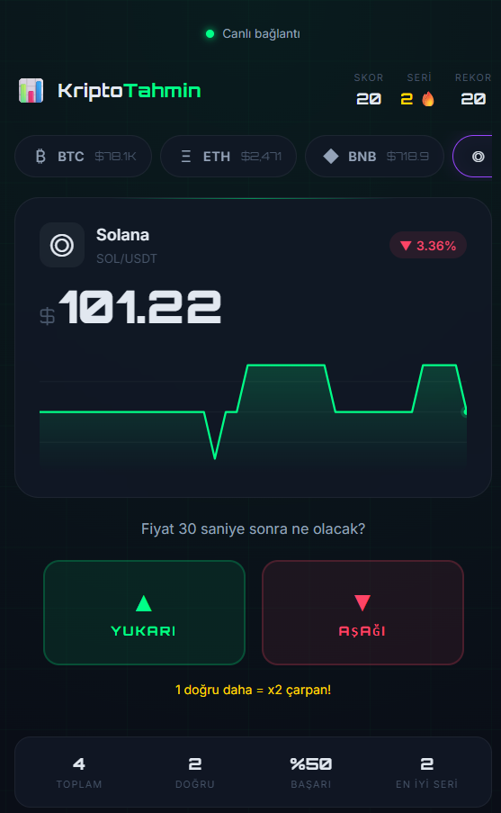

# KriptoTahmin



Canlı kripto fiyatlarıyla oynanan küçük bir fiyat tahmin oyunu.

Bu projeyi, kripto verisiyle çalışan daha büyük bir raporlama aracına başlamadan önce küçük bir hafta sonu prototipi olarak yaptım. Binance WebSocket üzerinden BTC, ETH, BNB, SOL ve AVAX fiyatlarını canlı takip ediyor; oyuncu fiyatın kısa süre sonra yukarı mı aşağı mı gideceğini tahmin ediyor.

## Özellikler

- Canlı Binance WebSocket fiyat akışı
- BTC, ETH, BNB, SOL ve AVAX desteği
- Yukarı/aşağı tahmin mekaniği
- Skor, seri, rekor ve başarı oranı
- Canvas tabanlı mini fiyat grafiği
- LocalStorage ile istatistik kaydı
- Mobil uyumlu koyu tema

## Çalıştırma

Projeyi herhangi bir statik dosya sunucusuyla çalıştırabilirsin.

```bash
npx serve .
```

Ardından tarayıcıda aç:

```text
http://localhost:3000
```

Alternatif olarak `index.html` dosyasını doğrudan tarayıcıda da açabilirsin.

## Teknolojiler

- HTML
- CSS
- JavaScript
- Canvas API
- Binance WebSocket API

## Not

Bu proje eğitim ve portföy amacıyla yaptığım bir oyundur. Yatırım tavsiyesi, al-sat sinyali veya finansal karar aracı değildir.
